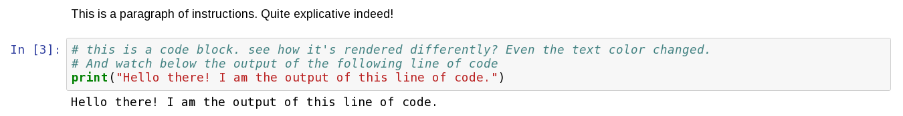

# Code Camp
*An on-line coding primer for the GSA theme in King's College London's Department of Geography*

---

### List of Contents

Welcome! This is the repository for the interactive Jupyter notebooks that will teach you the basics of how to code in Python for
Geographic Data Analysis.

The list of topics include:
- [Notebook-1: Introduction](./notebook-011.ipynb)
- [Notebook-2: Thinking like a computer](./notebook-02.ipynb)
- [Notebook-3: The Basics](./notebook-03.ipynb)
- [Notebook-4: Dealing with Errors & Debugging](./notebook-04.ipynb)
- [Notebook-5: Truth & Conditions](./notebook-05.ipynb)
- [Notebook-6: Lists and Dictionaries](./notebook-06.ipynb)
- [Notebook-7: Loops & Iteration](./notebook-07.ipynb)
- [Notebook-8: Data Types advanced](./notebook-08.ipynb)
- [Notebook-9: An Intro to Functions](./notebook-09.ipynb)
- [Notebook-10: Wrap-Up](./notebook-10.ipynb)

### Learning Outcomes

By the end of the course, you will have a solid understanding of:

- The rational behind the usage of computers and computational methodologies in Geography
- The way computers "think" and "work"
- How computers programs are structured and how to execute them
- The fundamental concepts of programming (in Python, but extensible in general terms to any other programming language) such as the concept of `variable`, `iteration`, `data structure`, `list`, `object`, `loop`, `function` etc etc..
- How your newly acquired coding skills can extend traditional GIS methodologies and be applied to solve to geographical problems

<!-- ### Set-up

The Jupyter Notebook format will allow you to see both the instructions, the code, and its outcome on this website, e.g.:

However, wouldn't it be much more fun and fruitful if you could actually **run** (i.e. execute) that code on you own machine?

To do so, you will need to:
-  Download the notebooks
	- METHOD A: download the whole repository (click the green button on the top-right corner that says "clone or download") and decompress the `.zip` file.
	- METHOD B: if you want to have just the single notebook and not the whole repository then click on the notebook name, this will bring you to the rendered notebook. Click on 'raw', and then right-click on the web-page and 'save-as' wherever you want that file on your local filesystem
-  Install Jupyter. There are various ways but the easiest one is via Anaconda (that's basically a collection of the python programming language and of it most used libraries, already bundled up for you convenience.) Follow the instructions [here](http://jupyter.readthedocs.io/en/latest/install.html#id3).
- Run the notebook! From Jupyter's [web-page](http://jupyter-notebook-beginner-guide.readthedocs.io/en/latest/execute.html):

	> (*Windows*): The Jupyter Notebook App can be launched by clicking on the Jupyter Notebook icon installed by Anaconda in the start menu (Windows) or by typing in a terminal (cmd on Windows): `jupyter notebook`

	> (*Mac OSX*): Click on spotlight, type 'terminal' to open a terminal window. Enter the startup folder by typing `cd /some_folder_name`. Type jupyter notebook to launch the Jupyter Notebook App (it will appear in a new browser window or tab).

For a quick-primer on how to install and interact with a Jupyter Notebook follow this tutorial from [OpenTechSchool](http://opentechschool.github.io/python-data-intro/core/notebook.html)
-->

### References:
The material contained in this repository is heavily inspired by the [great work](http://darribas.org/gds15/index.html) of [Dani Aribas-Bel](https://twitter.com/darribas):
`Arribas-Bel, D. (2016). Geographic Data Science’15. http://doi.org/{10.5281/zenodo.46313}`
